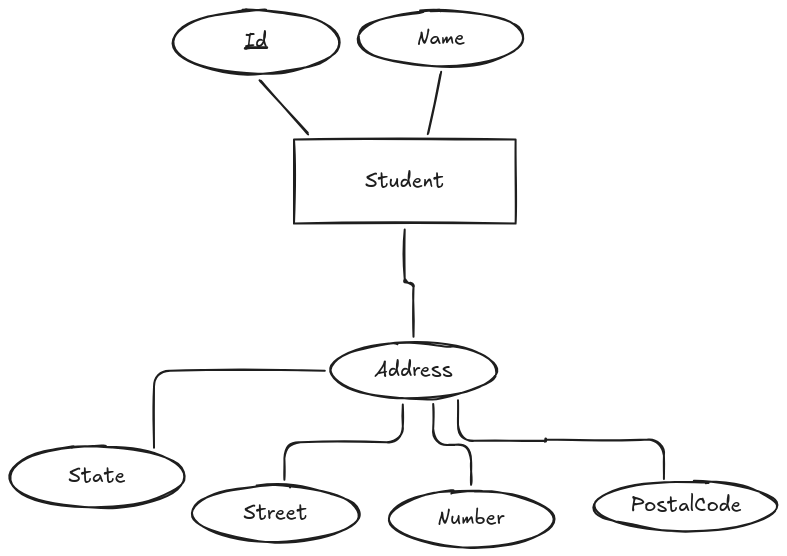
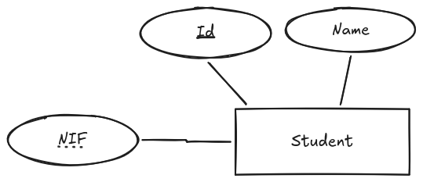

# Atributos y Claves

Los atributos son propiedades o características que describen a una entidad en el modelo de datos. Cada atributo tiene un nombre, un tipo de dato y un valor asociado. Los atributos pueden ser simples o compuestos, y algunos pueden ser clave primaria o clave foránea.

En un diagrama E/R, los atributos se representan mediante elipses conectadas a la entidad correspondiente mediante líneas. 

## Tipos de atributos

Existen diferentes tipos de atributos que se pueden utilizar para describir a una entidad en un modelo de datos. Algunos de los tipos de atributos más comunes son:

* **Atributos simples**: Son aquellos que no se pueden descomponer en subatributos. Por ejemplo, el atributo "Nombre" de una entidad "Cliente" es un atributo simple, ya que no se puede dividir en partes más pequeñas.
* **Atributos compuestos**: Son aquellos que se pueden descomponer en subatributos. Por ejemplo, el atributo "Dirección" de una entidad "Cliente" puede ser un atributo compuesto, ya que se puede dividir en subatributos como "Calle", "Número", "Ciudad" y "Código Postal".

### Atributos simples

Un atributo simple es aquel que no se puede descomponer en subatributos. Por ejemplo, el atributo "Nombre" de una entidad "Cliente" es un atributo simple, ya que no se puede dividir en partes más pequeñas.

Es importante identificar correctamente los atributos simples de una entidad, ya que estos son los que se utilizarán para almacenar la información en la base de datos.

### Atributos compuestos

Un atributo compuesto es aquel que se puede descomponer en subatributos. Por ejemplo, el atributo "Dirección" de una entidad "Cliente" puede ser un atributo compuesto, ya que se puede dividir en subatributos como "Calle", "Número", "Ciudad" y "Código Postal".

Identificar correctamente los atributos compuestos de una entidad es importante para garantizar un diseño adecuado de la base de datos y evitar problemas de redundancia o inconsistencia en los datos.

Los atributos compuestos se representan en un diagrama E/R mediante elipses conectadas a la entidad correspondiente mediante líneas, y los subatributos se representan mediante elipses conectadas al atributo compuesto mediante líneas.

<figure>
  
  <figcaption>Representación de atributos compuestos en un diagrama E/R</figcaption>
</figure>

## Atributos clave

Uno de los aspectos más importantes en el diseño de una base de datos es la identificación de los atributos clave. Los atributos clave son aquellos que se utilizan para identificar de manera única a cada instancia de una entidad. Estos atributos son fundamentales para garantizar la integridad y consistencia de los datos en la base de datos.

Un atributo clave es aquel que tiene un valor único para cada instancia de la entidad. Por ejemplo, en una entidad "Cliente", el atributo "Número de Cliente" puede ser un atributo clave, ya que cada cliente tiene un número único que lo identifica.

Este atributo debe ser capaz de identificar de manera única a cada instancia de la entidad, y no debe permitir valores duplicados. Además, los atributos clave son fundamentales para establecer relaciones entre entidades en el modelo de datos.

Existen diferentes tipos de atributos clave, como la clave primaria y la clave foránea. La clave primaria es un atributo o conjunto de atributos que identifica de manera única a cada instancia de una entidad, mientras que la clave foránea es un atributo que se utiliza para establecer relaciones entre entidades.

* **Clave primaria**: Es un atributo o conjunto de atributos que identifica de manera única a cada instancia de una entidad. Por ejemplo, en una entidad "Cliente", el atributo "Número de Cliente" puede ser la clave primaria, ya que cada cliente tiene un número único que lo identifica. Se representa en un diagrama E/R mediante un subrayado en el nombre del atributo.
* **Clave foránea**: Es un atributo que se utiliza para establecer relaciones entre entidades. Por ejemplo, en una entidad "Pedido", el atributo "Número de Cliente" puede ser una clave foránea que hace referencia al atributo "Número de Cliente" de la entidad "Cliente". Esto permite establecer una relación entre las entidades "Pedido" y "Cliente". Se representa en un diagrama E/R mediante una línea que conecta el atributo de la entidad dependiente con el atributo de la entidad principal (relación).
* **Clave candidata**: Es un atributo o conjunto de atributos que puede ser utilizado como clave primaria, pero no se ha seleccionado como tal. Por ejemplo, en una entidad "Cliente", el atributo "Correo Electrónico" puede ser una clave candidata, ya que cada cliente tiene un correo electrónico único que podría ser utilizado para identificarlo. Se representa en un diagrama E/R mediante un subrayado en el nombre del atributo, al igual que la clave primaria; pero en este caso la línea de subrayado es discontinua para diferenciarla de la clave primaria.

<figure>
  
  <figcaption>Representación de clave candidata en un diagrama E/R</figcaption>
</figure>