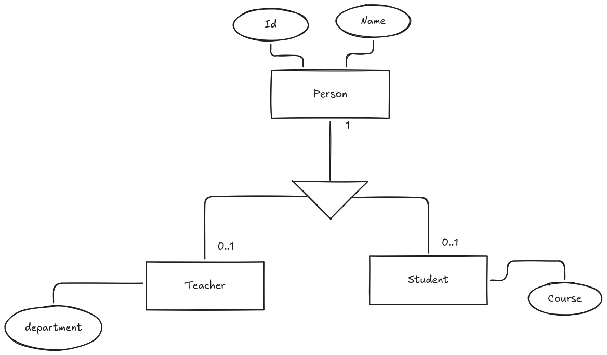
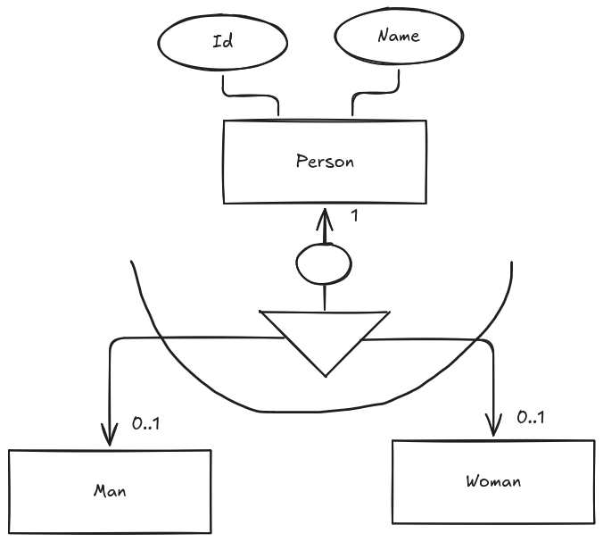

# Diagrama E/R extendido

Hasta ahora, hemos visto los conceptos básicos del modelado de datos y la estructura de las bases de datos, así como la interpretación de diagramas Entidad-Relación (E/R). En esta sección, nos centraremos en el diagrama E/R extendido, que es una versión más avanzada del diagrama E/R tradicional.

Hay algunas ocasiones en las que el diagrama E/R tradicional no es suficiente para representar todas las complejidades de un sistema. En estos casos, se utiliza el diagrama E/R extendido, que permite representar conceptos adicionales como la herencia, la especialización y la generalización.

## Herencia

La Herencia es un concepto que permite representar la relación entre una entidad padre y sus entidades hijas. En un diagrama E/R extendido, la herencia se representa mediante una línea que conecta la entidad padre con sus entidades hijas, indicando que las entidades hijas heredan los atributos y relaciones de la entidad padre.

Para representar la herencia en un diagrama E/R extendido, se utiliza un triángulo con una línea que conecta la entidad padre con sus entidades hijas. La entidad padre se coloca en la parte superior del triángulo, mientras que las entidades hijas se colocan en la parte inferior.

Es importante tener en cuenta que la herencia puede ser de dos tipos: total o parcial. En la herencia total, todas las entidades hijas heredan todos los atributos y relaciones de la entidad padre. En la herencia parcial, solo algunas entidades hijas heredan algunos atributos y relaciones de la entidad padre.

<figure>
  
  <figcaption>Representación de la herencia en un diagrama E/R extendido</figcaption>
</figure>

En la anterior figura, podemos observar un ejemplo de herencia en un diagrama E/R extendido. La Entidad "Persona"(Person) es la entidad padre, mientras que las entidades "Profesor"(Teacher) y "Estudiante"(Student) son las entidades hijas. La línea que conecta la entidad padre con sus entidades hijas indica que las entidades hijas heredan los atributos y relaciones de la entidad padre.

## Generalización y especialización

La Generalización o Especialización es un concepto que permite representar la relación entre varias entidades hijas y su entidad padre. En un diagrama E/R extendido, la generalización se representa mediante una línea que conecta las entidades hijas con su entidad padre, indicando que las entidades hijas comparten atributos y relaciones comunes.

La principal diferencia entre la herencia y la generalización es que en la herencia, las entidades hijas heredan atributos y relaciones de la entidad padre, mientras que en la generalización, las entidades hijas comparten atributos y relaciones comunes.

Cuando nos referimos a generalización, hablamos de un proceso de abstracción en el que se identifican las características comunes de varias entidades hijas y se crean una entidad padre que las agrupa. Por otro lado, cuando hablamos de especialización, nos referimos a un proceso de refinamiento en el que se identifican las características específicas de una entidad hija y se crean subentidades que representan esas características.

<figure>
  
  <figcaption>Representación de la generalización en un diagrama E/R extendido</figcaption>
</figure>

### Parcialidad y totalización

En la generalización o especialización, es importante tener en cuenta el concepto de parcialidad y totalización. La parcialidad indica que no todas las entidades hijas están representadas en la entidad padre, mientras que la totalización indica que todas las entidades hijas están representadas en la entidad padre.

La parcialidad puede ser:

* **Parcial**: En la generalización parcial, no todas las entidades hijas están representadas en la entidad padre. Esto significa que algunas entidades hijas pueden tener atributos y relaciones que no están presentes en la entidad padre. En un diagrama E/R extendido, la generalización parcial se representa mediante una línea discontinua que conecta las entidades hijas con su entidad padre.
* **Total**: En la generalización total, todas las entidades hijas están representadas en la entidad padre. Esto significa que todas las entidades hijas comparten atributos y relaciones comunes que están presentes en la entidad padre. En un diagrama E/R extendido, la generalización total se representa mediante un círculo que conecta las entidades hijas con su entidad padre.

### Solapamiento

Es también importante tener en cuenta el concepto de solapamiento en la generalización o especialización. El solapamiento indica si una entidad hija puede pertenecer a más de una entidad padre.

En la generalización o especialización, el solapamiento puede ser:

* **Solapamiento**: En la generalización o especialización con solapamiento, una entidad hija puede pertenecer a más de una entidad padre. Esto significa que una entidad hija puede heredar atributos y relaciones de varias entidades padre. En un diagrama E/R extendido, la generalización o especialización con solapamiento se representa mediante una línea que conecta las entidades hijas con sus entidades padre, y se indica mediante un símbolo de solapamiento en la línea (Círculo).
* **No solapamiento**: En la generalización o especialización sin solapamiento, una entidad hija solo puede pertenecer a una entidad padre. Esto significa que una entidad hija solo puede heredar atributos y relaciones de una entidad padre. En un diagrama E/R extendido, la generalización o especialización sin solapamiento se representa mediante una línea que conecta las entidades hijas con su entidad padre, y se indica mediante un símbolo de no solapamiento en la línea.

### Exclusividad y no exclusividad

Por último, es importante tener en cuenta el concepto de exclusividad y no exclusividad en la generalización o especialización. La exclusividad indica si una entidad hija puede pertenecer a más de una entidad padre.

En la generalización o especialización, la exclusividad puede ser:

* **Exclusiva**: En la generalización o especialización exclusiva, una entidad hija solo puede pertenecer a una entidad padre. Esto significa que una entidad hija solo puede heredar atributos y relaciones de una entidad padre. En un diagrama E/R extendido, la generalización o especialización exclusiva se representa mediante una línea que conecta las entidades hijas con su entidad padre, y se indica mediante un símbolo de exclusividad en la línea (Línea recta).
* **No exclusiva**: En la generalización o especialización no exclusiva, una entidad hija puede pertenecer a más de una entidad padre. Esto significa que una entidad hija puede heredar atributos y relaciones de varias entidades padre. En un diagrama E/R extendido, la generalización o especialización no exclusiva se representa mediante una línea que conecta las entidades hijas con sus entidades padre, y se indica mediante un símbolo de no exclusividad (Línea curvada) en la línea.