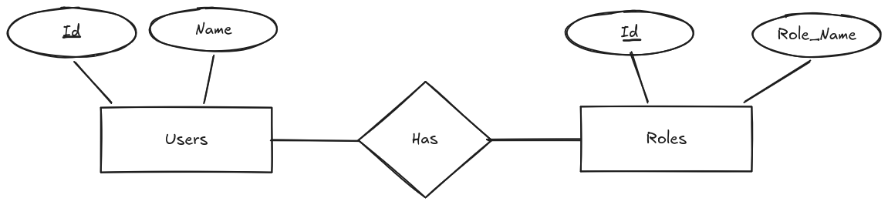

# Diagramas Entidad-Relación (E/R)

Los diagramas Entidad-Relación (E/R) son una herramienta de modelado de datos que permite representar gráficamente las entidades, sus atributos y las relaciones entre ellas. Estos diagramas son fundamentales para el diseño de bases de datos, ya que facilitan la comprensión y comunicación del modelo conceptual de la base de datos.

Estos diagramas son un paso para convertir el modelo conceptual en un modelo lógico, que posteriormente se implementará en un sistema de gestión de bases de datos relacional. 

Es importante mencionar que estos diagramas son una representación abstracta de la realidad del sistema que se desea modelar, y su correcta interpretación es crucial para garantizar la eficiencia, integridad y consistencia de la base de datos.

El saber diseñar e interpretar correctamente los diagramas E/R es esencial para el éxito de cualquier proyecto de base de datos, ya que permite identificar posibles problemas de diseño y optimizar la estructura de la base de datos antes de su implementación.

Existen diferents herramientas para diseñar diagramas E/R, tanto de software libre como propietario, que facilitan la creación y edición de estos diagramas. También hay diferentes notaciones para representar los diagramas E/R, como la notación de Chen, la notación de Crow's Foot y la notación UML, entre otras. Cada notación tiene sus propias características y ventajas, y la elección de una u otra dependerá de las preferencias del diseñador y de los requisitos del proyecto.

Veamos algunas de estas:

* **Notación de Chen**: Esta notación utiliza rectángulos para representar entidades, elipses para atributos y rombos para relaciones. Es una de las notaciones más utilizadas y reconocidas en el ámbito del modelado de datos.
* **Notación de Crow's Foot**: Esta notación utiliza líneas con diferentes formas en los extremos para representar las relaciones entre entidades. Es una notación muy utilizada en la industria y se considera más intuitiva que la notación de Chen.
* **Notación UML**: Esta notación utiliza diagramas de clases para representar las entidades, sus atributos y las relaciones entre ellas. Es una notación ampliamente utilizada en el desarrollo de software y se integra bien con otros diagramas UML.

<figure>
  
  <figcaption>Diagrama E/R en notación de Chen.</figcaption>
</figure>

En la anterior figura, podemos observar diferentes elementos de un diagrama E/R en notación de Chen; algunos de estos elementos son:

* **Entidades**: Representadas por rectángulos, las entidades son objetos o conceptos del mundo real que tienen una existencia independiente y se pueden identificar de manera única. Por ejemplo, "Cliente", "Producto" o "Empleado" son entidades.
* **Atributos**: Representados por elipses, los atributos son propiedades o características de las entidades. Por ejemplo, un "Cliente" puede tener atributos como "Nombre", "Dirección" y "Teléfono". Los atributos pueden ser simples o compuestos, y algunos pueden ser clave primaria o clave foránea.
* **Relaciones**: Representadas por rombos, las relaciones son asociaciones entre entidades.

En las siguientes secciones, profundizaremos en la interpretación de diagramas E/R, la conversión de estos diagramas a tablas y el proceso de normalización de bases de datos.