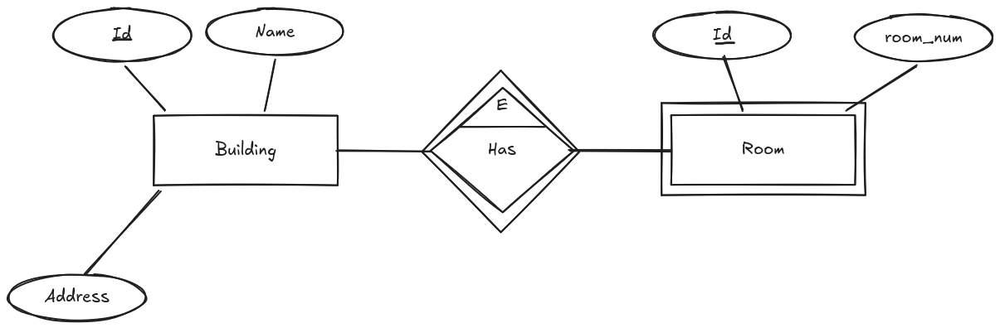
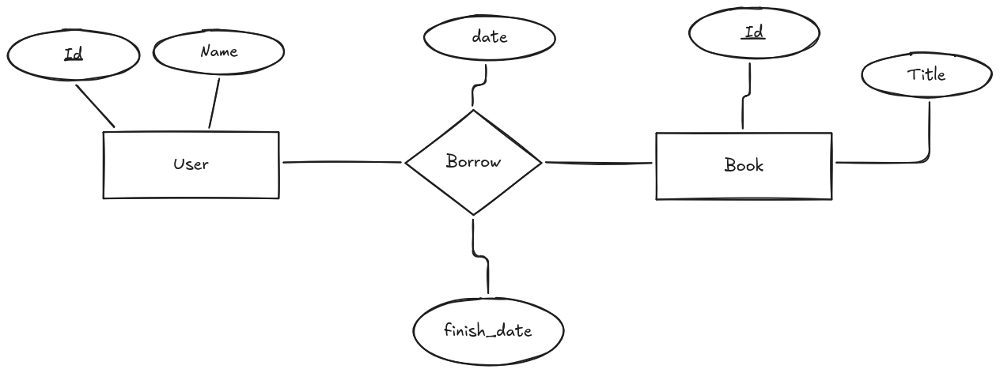
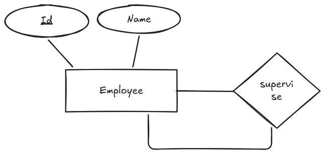

# Entidades y Relaciones

Vamos a ver en más detalle que son las entidades y relaciones, y cómo se representan en los diagramas Entidad-Relación (E/R).

## Entidades

Las entidades son objetos o conceptos del mundo real que tienen una existencia independiente y se pueden identificar de manera única. Por ejemplo, "Cliente", "Producto" o "Empleado" son entidades. Cada entidad tiene un conjunto de atributos que describen sus propiedades o características.

Cada entidad se representa en un diagrama E/R mediante un rectángulo, y sus atributos se representan mediante elipses conectadas al rectángulo de la entidad. Algunos atributos pueden ser clave primaria o clave foránea, lo que significa que se utilizan para identificar de manera única a cada instancia de la entidad o para establecer relaciones con otras entidades.

Una entidad no tiene por que ser un objeto físico, puede ser un concepto abstracto, como "Pedido" o "Factura". Lo importante es que la entidad tenga una existencia independiente y se pueda identificar de manera única.

A la hora de identificar entidades en un sistema, es importante tener en cuenta los siguientes criterios:

* **Existencia independiente**: La entidad debe tener una existencia propia y no depender de otras entidades para su identificación.
* **Identificación única**: La entidad debe poder ser identificada de manera única mediante un conjunto de atributos, que pueden incluir una clave primaria.
* **Relevancia para el sistema**: La entidad debe ser relevante para el sistema que se está modelando y tener un propósito claro dentro del contexto del negocio o aplicación.

### Entidad Fuerte y Entidad Débil

Hemos comentado que una entidad tiene una existencia independiente, pero hay entidades que dependen de otras para su existencia. A estas entidades se les llama entidades débiles, mientras que a las que tienen una existencia independiente se les llama entidades fuertes.

Una entidad débil se representa en un diagrama E/R mediante un rectángulo con doble línea, mientras que una entidad fuerte se representa mediante un rectángulo con una sola línea. Las entidades débiles dependen de una entidad fuerte para su identificación y no pueden existir por sí solas.

Normalmente las entidades débiles tienen una relación de dependencia con la entidad fuerte, y esta relación se representa mediante un rombo con doble línea en el diagrama E/R. También es importante que las relaciones sean principalmente de dos tipos:

* **Relación de Identificación**: La entidad débil depende de la entidad fuerte para su identificación y no puede existir sin ella. Por ejemplo, un "Detalle de Pedido" depende de un "Pedido" para su existencia. Se representa mediante un rombo con doble línea en el diagrama E/R y estableciendo la palabra id en la parte superior.
* **Relación de Existencia**: La entidad débil depende de la entidad fuerte para su existencia, pero puede existir sin ella. Por ejemplo, un "Empleado" puede existir sin un "Departamento", pero un "Departamento" no puede existir sin un "Empleado". Se representa mediante un rombo con una sola línea en el diagrama E/R.

<figure>
  
  <figcaption>Representación de entidades fuertes y débiles en un diagrama E/R</figcaption>
</figure>

## Relaciones

Una relación es una asociación entre dos o más entidades. Las relaciones permiten establecer cómo se conectan las entidades y cómo interactúan entre sí. Por ejemplo, un "Cliente" puede realizar un "Pedido", lo que establece una relación entre las entidades "Cliente" y "Pedido".

Una relación se representa en un diagrama E/R mediante un rombo, y las entidades involucradas en la relación se conectan al rombo mediante líneas. Cada relación puede tener un conjunto de atributos que describen sus propiedades o características.

A la hora de diseñar relaciones en un sistema, es importante tener en cuenta los siguientes criterios:

* **Cardinalidad**: La cardinalidad de una relación indica el número de instancias de una entidad que pueden estar asociadas con una instancia de otra entidad. Por ejemplo, un "Cliente" puede realizar muchos "Pedidos", pero un "Pedido" solo puede ser realizado por un "Cliente". La cardinalidad se representa mediante números o símbolos en las líneas que conectan las entidades con el rombo de la relación.
* **Participación**: La participación de una entidad en una relación indica si la entidad es obligatoria o opcional en la relación. Por ejemplo, un "Empleado" puede estar asignado a un "Departamento", pero un "Departamento" puede existir sin empleados. La participación se representa mediante líneas continuas (obligatoria) o discontinuas (opcional) en las líneas que conectan las entidades con el rombo de la relación.
* **Atributos de la relación**: Las relaciones pueden tener atributos que describen sus propiedades o características. Por ejemplo, una relación "Realiza" entre "Cliente" y "Pedido" puede tener un atributo "Fecha de Pedido". Los atributos de la relación se representan mediante elipses conectadas al rombo de la relación.

### Atributos de la relación

En una relación, los atributos pueden ser simples o compuestos, y algunos pueden ser clave primaria o clave foránea. Los atributos de la relación se representan mediante elipses conectadas al rombo de la relación.

Es importante tener en cuenta que los atributos de la relación no son atributos de las entidades involucradas en la relación, sino que describen propiedades o características de la relación en sí misma.

Por ello, es importante identificar correctamente los atributos de la relación y diferenciarlos de los atributos de las entidades, para garantizar un diseño adecuado de la base de datos y evitar problemas de redundancia o inconsistencia en los datos.

<figure>
  
  <figcaption>Representación de atributos de la relación en un diagrama E/R</figcaption>
</figure>

### Relaciones Reflexivas

Existen relaciones que involucran a la misma entidad, estas se llaman relaciones reflexivas o recursivas. Por ejemplo, un "Empleado" puede supervisar a otros "Empleados", lo que establece una relación reflexiva entre la entidad "Empleado".

Una relación reflexiva se representa en un diagrama E/R mediante un rombo conectado a la misma entidad mediante líneas. La cardinalidad y participación de la relación se representan de la misma manera que en las relaciones entre diferentes entidades.

<figure>
  
  <figcaption>Representación de una relación reflexiva en un diagrama E/R</figcaption>
</figure>