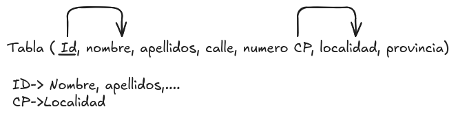

# Introduccion

La normalización es un proceso de diseño de bases de datos que consiste en organizar los datos de una manera que minimice la redundancia y mejore la integridad de los mismos.

Cuando se diseña una base de datos, es común que se presenten problemas de redundancia y dependencia de los datos. La normalización ayuda a resolver estos problemas mediante la aplicación de un conjunto de reglas y principios que permiten dividir los datos en tablas más pequeñas y relacionadas entre sí.

Este proceso se realiza a través de varias etapas, conocidas como formas normales, que van desde la primera forma normal (1NF) hasta la quinta forma normal (5NF). Cada forma normal tiene sus propias reglas y requisitos que deben cumplirse para garantizar que los datos estén organizados de manera eficiente.

Normalmente este proceso se realiza durante la fase de diseño de la base de datos, antes de que se implemente físicamente. Sin embargo, también puede ser necesario realizar ajustes y mejoras en la normalización de una base de datos existente para optimizar su rendimiento y mantener la integridad de los datos.

Antes de aplicar la normalización, es importante tener en cuenta que no siempre es necesario llegar a la forma normal más alta. En algunos casos, puede ser más beneficioso mantener cierta redundancia para mejorar el rendimiento de las consultas y reducir la complejidad del diseño.

Antes de comenzar, vamos a tener en cuenta que necesitaremos establecer las diferentes dependencias entre los datos, para ello utilizaremos las dependencias funcionales, que nos permitirán identificar cómo se relacionan los diferentes atributos de una tabla y cómo se pueden dividir en tablas más pequeñas.

Una **dependencia funcional** se produce cuando un atributo (o conjunto de atributos) determina de manera única el valor de otro atributo (o conjunto de atributos). Por ejemplo, si tenemos una tabla de empleados con los atributos "ID de empleado" y "Nombre", podemos decir que "ID de empleado" determina de manera única el valor de "Nombre", ya que cada empleado tiene un ID único.

Normalmente se representa una dependencia funcional mediante la notación A → B, donde A es el atributo determinante y B es el atributo dependiente. En este caso, podemos escribir "ID de empleado" → "Nombre". También se suele representar cuando se realiza el paso a tablas con la siguiente nomenclatura:

<figure>
  
  <figcaption>Representación de una dependencia funcional</figcaption>
</figure>

En este caso podemos ver 2 dependencias funcionales:

* La primera dependencia funcional es "ID" → "Nombre", lo que significa que el valor del atributo "ID de empleado" determina de manera única el valor del atributo "Nombre". En otras palabras, si conocemos el ID de un empleado, podemos determinar su nombre de manera única. Esta dependencia funcional es importante y debe estar en todas las tablas ya que garantiza la integridad de los datos y evita la duplicación de información.
* La segunda dependencia funcional es "CP"-> "Localidad", lo que significa que el valor del atributo "Código Postal" determina de manera única el valor del atributo "Localidad". En otras palabras, si conocemos el código postal de un empleado, podemos determinar su localidad de manera única. Esta dependencia funcional es importante y debe estar en todas las tablas ya que garantiza la integridad de los datos y evita la duplicación de información.

Detectar correctamente las dependencias funcionales es crucial para aplicar la normalización de manera efectiva. Al identificar estas dependencias, podemos dividir los datos en tablas más pequeñas y relacionadas, lo que nos permite reducir la redundancia y mejorar la integridad de los datos.