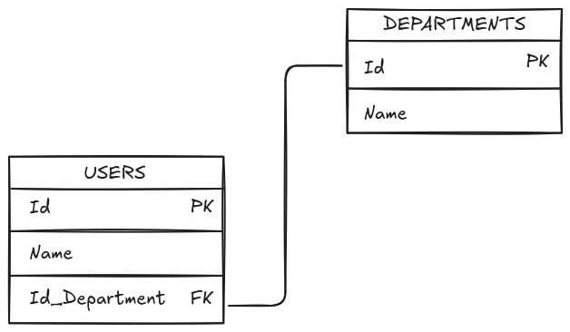
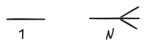

# El Modelo Relacional

El modelo relacional es un modelo de datos que organiza la información en tablas, también conocidas como relaciones. Cada tabla está compuesta por filas y columnas, donde cada fila representa un registro único y cada columna representa un atributo del registro.

En este modelo, las tablas se relacionan entre sí a través de claves primarias y claves foráneas, lo que permite establecer relaciones lógicas entre los datos.

Se trata de un modelo muy utilizado en bases de datos debido a su simplicidad y eficacia para manejar grandes volúmenes de información.

A veces puede confundirse con el modelo entidad-relación, pero es importante destacar que el modelo relacional es una representación más concreta y estructurada de los datos, mientras que el modelo entidad-relación es una representación más abstracta y conceptual.

Veamos como se representa cada elemento del modelo relacional.

## Tablas

Cada tabla se representa con un nombre y una lista de atributos, donde se indica cuál es la clave primaria y cuáles son las claves foráneas.

Una tabla se representa de la siguiente manera:

<figure>
  
  <figcaption>Modelo Relacional</figcaption>
</figure>

En este caso se muestran 2 tablas "Users" y "Departments".

Vemos que se muestran algunas tablas con sus atributos, y se indica cuál es la clave primaria y cuáles son las claves foráneas.

## Claves

En el modelo relacional, las claves son fundamentales para establecer relaciones entre las tablas y garantizar la integridad de los datos.

Vamos a ver como representar algunas:

* **Clave primaria**: Se representa Añadiendo a la derecha de su nombre, el símbolo "PK" indicando que es una clave primaria.
* **Clave foránea**: Se representa Añadiendo a la derecha de su nombre, el símbolo "FK" indicando que es una clave foránea. Además se añade una flecha que indica a qué tabla hace referencia, y si es una relación 1 a N se establece una flecha que indica la cardinalidad de la relación.

<figure>
  
  <figcaption>Modelo Relacional: Claves</figcaption>
</figure>