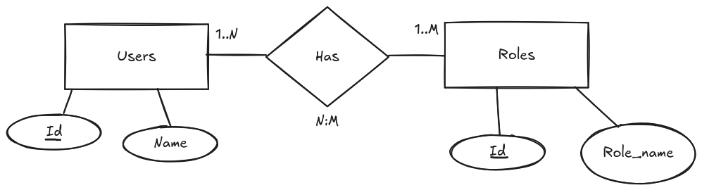
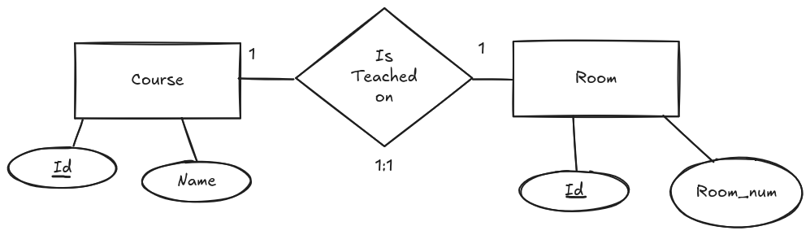
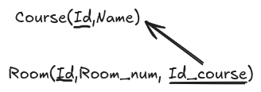
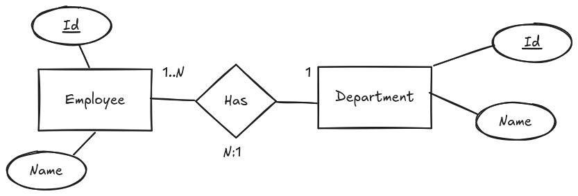
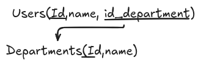
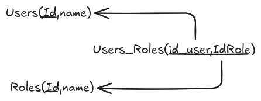
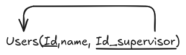

# El proceso de paso a tablas

Vamos a ver cómo se realiza el paso a tablas, es decir, cómo se transforman las entidades y relaciones del modelo entidad-relación en tablas que se implementarán en una base de datos relacional.

Es importante mencionar que este proceso implica definir las estructuras de las tablas, sus atributos, claves primarias y foráneas, así como las relaciones entre ellas.

Vamos a partir de un diagrama entidad-relación y veremos cómo convertir cada componente en una tabla correspondiente, asegurando que se mantenga la integridad de los datos y se optimice el diseño de la base de datos.

<figure>
  
  <figcaption>E-R: Paso a tablas</figcaption>
</figure>

Vamos a ver cómo se realiza el paso a tablas, es decir, cómo se transforman las entidades y relaciones del modelo entidad-relación en tablas que se implementarán en una base de datos relacional.

Cada tabla se va a representar con la siguiente notación:

NombreTabla (Atributo1, Atributo2, ..., AtributoN)

Si la tabla tiene una clave primaria, se indicará con un subrayado del atributo correspondiente. Si hay una clave foránea, se indicará con un subrayado del atributo correspondiente y se añadirá una flecha que indique a qué tabla hace referencia.

En caso de que haya claves candidatas, se indicará con un subrayado del atributo correspondiente y se añadirá una flecha que indique a qué tabla hace referencia.

Veamos un ejemplo de cómo se representaría una tabla con clave primaria y clave foránea:

Usuario (<ins>id_usuario</ins>, nombre, email, id_rol)

Una vez vista la notación, vamos a ver cómo se realiza el paso a tablas para cada componente del modelo entidad-relación.

## Entidades

Comenzamos por las entidades. Cada entidad se va a transformar en una tabla, y cada atributo de la entidad se va a transformar en una columna de la tabla.

Es importante que cada tabla tenga una clave primaria, que será el atributo que identifique de manera única a cada fila de la tabla.

Las claves foráneas se van a utilizar para establecer relaciones entre las tablas, y se van a definir en las tablas que representen las entidades relacionadas.

En el caso anterior, la entidad "User" se ha transformado en la tabla "Users", y el atributo "id" es una clave primaria que identifica de manera única a cada usuario.

En este caso la tabla sería:

Users(<ins>id</ins>, name)

Para la entidad "Role", la tabla sería:

Roles(<ins>id</ins>, name)

!!! info
    Es improtante mencionar que aunque ambas tablas tienen los mismos atributos, no son iguales. La tabla "Users" tiene una clave primaria que identifica de manera única a cada usuario, mientras que la tabla "Roles" tiene una clave primaria que identifica de manera única a cada rol.

## Relaciones

Una vez vistas las entidades, vamos a ver cómo se transforman las relaciones en tablas.

Las relaciones dependiendo del tipo de relación que tengamos, se van a transformar en tablas de diferentes maneras.

### Relaciones 1 a 1

En el caso de relaciones 1 a 1, se puede optar por añadir la clave foránea en cualquiera de las dos tablas que representan las entidades relacionadas.

Supongamos que tenemos el siguiente diagrama entidad-relación:

<figure>
  
  <figcaption>Relación 1 a 1</figcaption>
</figure>

En este caso las tablas serían:

<figure>
  
  <figcaption>Relación 1 a 1: Tablas</figcaption>
</figure>

Como vemos la tabla "Room" tiene una clave foránea que hace referencia a la tabla "Course".

### Relaciones 1 a N

En el caso de una relación 1 a N, la clave foránea se añade en la tabla que representa la entidad del lado N de la relación.

Supongamos que tenemos el siguiente diagrama entidad-relación:

<figure>
  
  <figcaption>Relación 1 a N</figcaption>
</figure>

Podemos observar 2 entidades: User y Department. La relación entre ellas es de 1 a N, es decir, un usuario puede pertenecer a un departamento, pero un departamento puede tener varios usuarios.

Para este caso, la tabla "Users" tendría una clave foránea que hace referencia a la tabla "Departments".

<figure>
  
  <figcaption>Relación 1 a N: Tablas</figcaption>
</figure>

### Relaciones N a N

En el caso de relaciones N a N, se crea una tabla intermedia que contiene las claves primarias de las dos tablas que representan las entidades relacionadas.

Es importante mencionar que si la relación tiene atributos, estos se añaden a la tabla intermedia.

<figure>
  
  <figcaption>Relación N a N</figcaption>
</figure>

En este caso la tabla intermedia se llamará "User_Role" y tendrá como claves primarias las claves primarias de las tablas "Users" y "Roles".

<figure>
  
  <figcaption>Relación N a N: Tablas</figcaption>
</figure>

## Relaciones especiales

Existen diferentes casos especiales de relaciones que se pueden dar en un modelo entidad-relación, y que requieren un tratamiento especial a la hora de transformarlas en tablas.

### Relaciones recursivas (Reflexivas)

En el caso de las relaciones recursivas, se añade una clave foránea en la tabla que representa la entidad, que hace referencia a la misma tabla.

<figure>
  
  <figcaption>Relación recursiva</figcaption>
</figure>

En este caso, la tabla "Employee" tendría una clave foránea que hace referencia a la misma tabla, para indicar quién es el supervisor de cada empleado.

<figure>
  
  <figcaption>Relación recursiva: Tablas</figcaption>
</figure>

### Especialización y generalización

En el caso de la especialización y generalización, se pueden dar diferentes casos dependiendo de si la relación es total o parcial, y si es disjunta o superpuesta.

Si la relación es total, se puede optar por añadir la clave foránea en la tabla que representa la entidad general, o bien crear una tabla intermedia que contenga las claves primarias de las tablas que representan las entidades especializadas.

En el caso de que la relación sea parcial, se puede optar por añadir la clave foránea en la tabla que representa la entidad especializada, o bien crear una tabla intermedia que contenga las claves primarias de las tablas que representan las entidades especializadas.