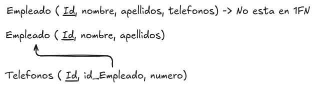

# Primera forma normal (1FN)

Como hemos comentado en la introducción, para realizar el proceso de normalización, es necesario identificar las dependencias funcionales entre los atributos de una tabla. Una vez que se han identificado estas dependencias, podemos aplicar las reglas de la primera forma normal (1FN) para organizar los datos de manera eficiente.

Una tabla se encuentra en primera forma normal (1FN) si cumple con las siguientes condiciones:

* Todos los atributos contienen valores atómicos, es decir, no se permiten valores repetidos o conjuntos de valores en una sola celda. Cada celda debe contener un único valor indivisible.
* No existen grupos de atributos que se repitan en la misma fila.

Esto quiere decir que una tabla no puede tener atributos que contengan listas o conjuntos de valores, ni puede tener filas duplicadas. Cada fila debe ser única y cada celda debe contener un solo valor.

Si una tabla no cumple con estas condiciones, se deben realizar los ajustes necesarios para llevarla a la primera forma normal. Esto puede implicar dividir los atributos que contienen valores repetidos en tablas separadas y establecer relaciones entre ellas mediante claves primarias y foráneas.

Por ejemplo si tenemos una tabla de empleados que contiene un atributo "Teléfonos" que almacena varios números de teléfono en una sola celda, debemos dividir este atributo en una tabla separada que contenga un registro por cada número de teléfono asociado a un empleado. De esta manera, cada celda contendrá un único valor y la tabla estará en primera forma normal.

<figure>
  
  <figcaption>Representación de la primera forma normal</figcaption>
</figure>

En este ejemplo podemos ver como en la tabla empleado el atributo "Teléfonos" contiene varios valores en una sola celda, lo que viola la primera forma normal. Para solucionar esto, hemos creado una tabla separada llamada "Teléfonos" que contiene un registro por cada número de teléfono asociado a un empleado. De esta manera, cada celda contiene un único valor y la tabla está en primera forma normal.

Es importante revisar todos los atributos de una tabla para asegurarse de que cumplen con las condiciones de la primera forma normal. Si se identifican atributos que no cumplen con estas condiciones, se deben realizar los ajustes necesarios para llevar la tabla a la primera forma normal y garantizar la integridad de los datos.