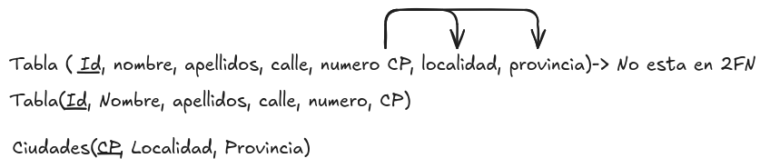

# Segunda Forma Normal (2FN)

Una vez que una tabla se encuentra en primera forma normal (1FN), podemos aplicar las reglas de la segunda forma normal (2FN) para organizar los datos de manera más eficiente.

Para que una tabla esté en segunda forma normal (2FN), debe cumplir con las siguientes condiciones:

* La tabla debe estar en primera forma normal (1FN).
* Todos los atributos no clave deben depender completamente de la clave primaria. Esto significa que no debe haber dependencias parciales, es decir, ningún atributo no clave debe depender solo de una parte de la clave primaria si esta es compuesta.

Esto es importante para evitar la redundancia y mejorar la integridad de los datos. Si una tabla tiene dependencias parciales, se deben realizar los ajustes necesarios para llevarla a la segunda forma normal.

Veamos un ejemplo:

<figure>
  
  <figcaption>Representación de la segunda forma normal</figcaption>
</figure>

En este caso la tabla tiene atributos como CP, Localidad y Provincia que dependen parcialmente de la clave primaria (ID de empleado). Para llevar esta tabla a la segunda forma normal, debemos dividirla en dos tablas separadas: una tabla de empleados y una tabla de localidades. De esta manera, cada atributo no clave depende completamente de la clave primaria correspondiente.

Es importante identificar correctamente las dependencias parciales y realizar los ajustes necesarios para llevar la tabla a la segunda forma normal. Esto nos permitirá reducir la redundancia y mejorar la integridad de los datos en nuestra base de datos.