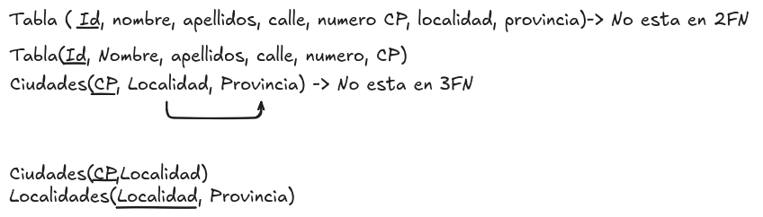

# Tercera Forma Normal (3FN)

La tercera forma normal (3FN) es un paso adicional en el proceso de normalización de bases de datos, que busca eliminar dependencias transitivas entre los atributos no clave y la clave primaria.

Para que una tabla esté en tercera forma normal (3FN), debe cumplir con las siguientes condiciones:

* La tabla debe estar en segunda forma normal (2FN).
* Ningún atributo no clave debe depender de otro atributo no clave. Esto significa que no debe haber dependencias transitivas, es decir, ningún atributo no clave debe depender de otro atributo no clave a través de la clave primaria.

Una dependencia transitiva ocurre cuando un atributo no clave depende de otro atributo no clave, que a su vez depende de la clave primaria. Esto puede generar redundancia y problemas de integridad en los datos.

Es decir, que un atributo A que depende de un atributo B, que a su vez depende de la clave primaria C, se considera una dependencia transitiva. En este caso, A depende de C a través de B, lo que viola la tercera forma normal.

Esto podemos verlo en un ejemplo de la tabla de empleados, donde el atributo "Provincia" depende del atributo "Localidad", que a su vez depende de la clave primaria "ID de empleado". En este caso, "Provincia" depende de "ID de empleado" a través de "Localidad", lo que constituye una dependencia transitiva.

Veamos el ejemplo:

<figure>
  
  <figcaption>Representación de la tercera forma normal</figcaption>
</figure>

En este caso, la tabla Localidades tiene una dependencia transitiva entre los atributos "Provincia" y "Localidad". Para llevar esta tabla a la tercera forma normal, debemos dividirla en dos tablas separadas: una tabla de localidades y una tabla de localidades. De esta manera, eliminamos la dependencia transitiva y cada atributo no clave depende directamente de la clave primaria correspondiente.

Es importante identificar correctamente las dependencias transitivas y realizar los ajustes necesarios para llevar la tabla a la tercera forma normal. Esto nos permitirá reducir la redundancia y mejorar la integridad de los datos en nuestra base de datos.