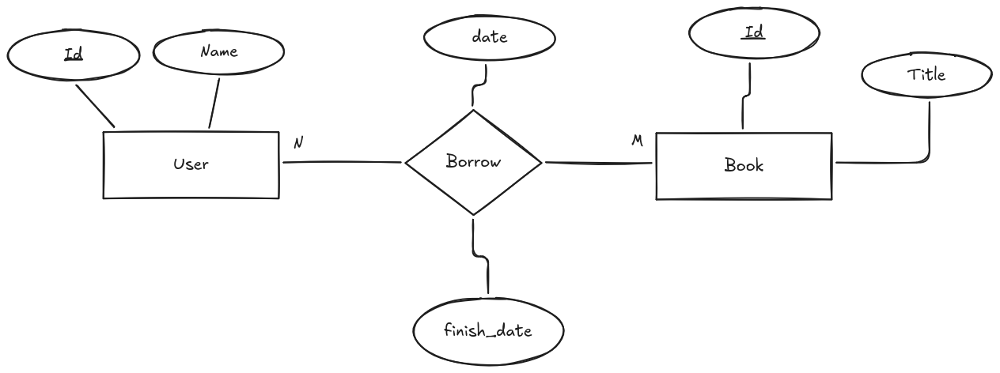
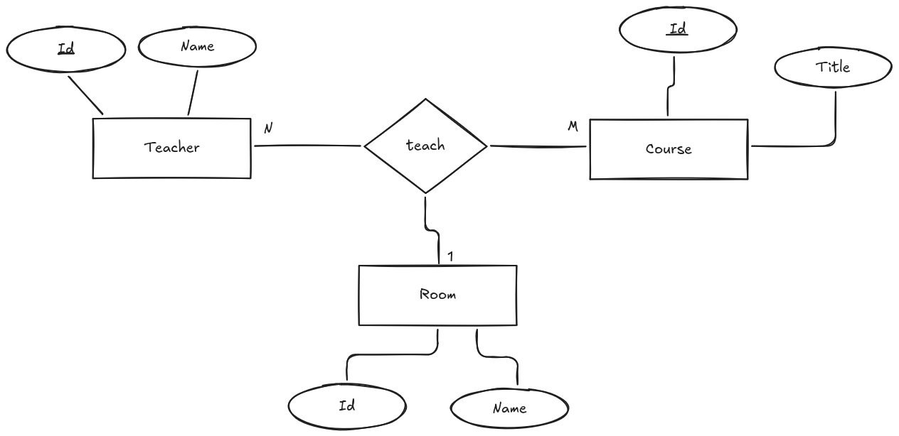

# Tipos de relaciones

A la hora de modelar un sistema, es importante identificar los diferentes tipos de relaciones que pueden existir entre las entidades. Las relaciones pueden clasificarse en varios tipos según su cardinalidad y participación.

Hemos hablado de algunos tipos de relaciones especiales como las relaciones reflexivas, pero existen otros tipos de relaciones que son importantes de conocer y comprender para un diseño adecuado de la base de datos.

Antes de continuar, vamos a ver el concepto de cardinalidad y participación, que son fundamentales para entender los diferentes tipos de relaciones.

## Cardinalidad

La cardinalidad de una relación indica el número de instancias de una entidad que pueden estar asociadas con una instancia de otra entidad. La cardinalidad se representa mediante números o símbolos en las líneas que conectan las entidades con el rombo de la relación.

Siempre hay dos cardinalidades en una relación, una para cada entidad involucrada. Por ejemplo, en una relación entre "Cliente" y "Pedido", la cardinalidad puede ser "1:N", lo que significa que un cliente puede realizar muchos pedidos, pero un pedido solo puede ser realizado por un cliente.

Veamos los tipos de cardinalidad más comunes:

* **Uno a uno (1:1)**: En una relación uno a uno, cada instancia de una entidad está asociada con una única instancia de otra entidad, y viceversa. Por ejemplo, un "Empleado" puede tener un "Carnet de Identidad", y cada "Carnet de Identidad" pertenece a un único "Empleado".
* **Uno a muchos (1:N)**: En una relación uno a muchos, una instancia de una entidad puede estar asociada con muchas instancias de otra entidad, pero cada instancia de la segunda entidad solo puede estar asociada con una instancia de la primera entidad. Por ejemplo, un "Cliente" puede realizar muchos "Pedidos", pero un "Pedido" solo puede ser realizado por un "Cliente".
* **Muchos a muchos (N:M)**: En una relación muchos a muchos, muchas instancias de una entidad pueden estar asociadas con muchas instancias de otra entidad. Por ejemplo, un "Estudiante" puede estar inscrito en muchos "Cursos", y un "Curso" puede tener muchos "Estudiantes" inscritos. Este tipo de relación requiere una tabla intermedia para su implementación en un modelo relacional.

Para representar la cardinalidad en un diagrama E/R de chen, se utilizan los siguientes símbolos:

* **1**: Representa una cardinalidad de uno.
* **N/M**: Representa una cardinalidad de muchos. En ocasiones referenciada como "0..N" o "1..N" para indicar la participación opcional u obligatoria de una entidad en una relación.

También se pueden utilizar otros símbolos como "0..1", "0..N" o "1..N" para indicar la participación opcional o obligatoria de una entidad en una relación. Además, se puede establecer una flecha en la línea que conecta la entidad con el rombo de la relación para indicar la dirección de la relación, es decir, cuál es la entidad principal y cuál es la entidad dependiente. Esto indica que la entidad principal es la que tiene la cardinalidad de uno, mientras que la entidad dependiente es la que tiene la cardinalidad de muchos.

<figure>
  
  <figcaption>Representación de la cardinalidad de relaciones en un diagrama E/R</figcaption>
</figure>

## Participación

La participación de una entidad en una relación indica si la entidad es obligatoria o opcional en la relación. La participación se representa mediante líneas continuas (obligatoria) o discontinuas (opcional) en las líneas que conectan las entidades con el rombo de la relación.

Existen dos tipos de participación:

* **Participación total**: En una participación total, todas las instancias de una entidad deben estar asociadas con al menos una instancia de otra entidad en la relación. Esto significa que la participación de la entidad en la relación es obligatoria. Por ejemplo, un "Empleado" debe estar asignado a un "Departamento", por lo que la participación del "Empleado" en la relación es total.
* **Participación parcial**: En una participación parcial, algunas instancias de una entidad pueden estar asociadas con instancias de otra entidad en la relación, mientras que otras no. Esto significa que la participación de la entidad en la relación es opcional. Por ejemplo, un "Cliente" puede realizar muchos "Pedidos", pero un "Pedido" solo puede ser realizado por un "Cliente". En este caso, la participación del "Cliente" en la relación es parcial.

## Relaciones Ternarias

Hemos hablado de relaciones entre dos entidades, pero también existen relaciones que involucran a tres o más entidades. Estas relaciones se llaman relaciones ternarias o n-arias.

Este tipo de relación se representa en un diagrama E/R mediante un rombo conectado a las entidades involucradas mediante líneas. La cardinalidad y participación de la relación se representan de la misma manera que en las relaciones entre dos entidades.

No es recomendable utilizar relaciones ternarias en un modelo de datos, ya que pueden ser difíciles de interpretar y mantener. En su lugar, se recomienda descomponer la relación ternaria en varias relaciones binarias, lo que facilita la comprensión y el diseño de la base de datos.

<figure>
  
  <figcaption>Representación de una relación ternaria en un diagrama E/R</figcaption>
</figure>

